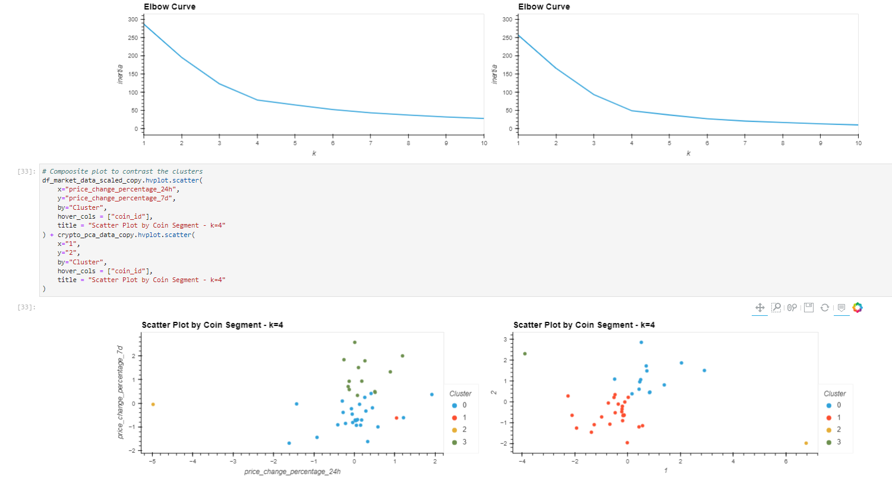

# module_10_challenge

The module 10 challenge for fintech course

The Jupyter Lab file follows along to create, update and work with the Pandas tools for unsupervised machine learning, specifically sklearn.

---

## Technologies

The sheet requires Pandas for analyzing data frames in jupyter labs.
It requires Jupyter Labs for a user interface.
It requires Path from pathlib to help read .csv files.
Requires hvplot, and sklearn.

---

## Installation Guide

Jupyter Labs runs in a browser, including Chrome.  Launch the file by navigating to the directory of the file through a CLI and then running Jupyter labs, with "jupyter lab".

hvplot can be installed form the CLI with the following:

conda install -c pyviz hvplot

sklearn comes installed standard with most jupyter lab and python builds.

---

## Usage

The worksheet runs through a scenario and teaches the user to work with sklearn.
It can be launched from Jupyter Lab to allow the user to see all the output and interact with the plots.

---

## Contributors

Michael Canavan

---

## License

The content of the course is owned and managed by UC Berkeley Fintech Bootcamp.